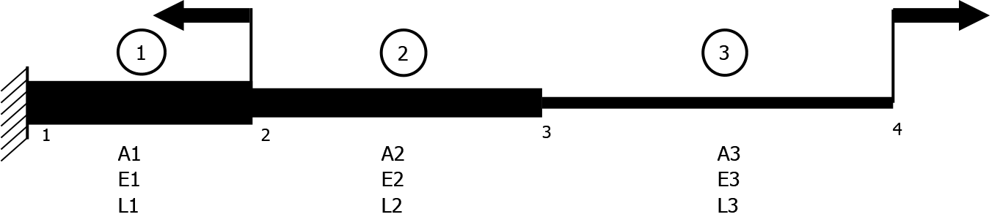

# 1 Dimensional Bar Element with 1 Degree of Freedom FEM Solver

<H1>About</H1>

This solver can be used to analyse 1 degree of freedom of 1 dimensional problems with bar elements connected in series and having 1D forces acting parallel to the axis of the bar. It uses the direct stiffness method and assembles the global nodal force vector, global element stiffness matrix, and the global nodal displacement vector and uses the elimination approach on the global relationship after applying all the boundary conditions provided by the user to solve for the unknown nodal displacements.


<H1>Instructions</H1>
 
1. Make sure you have Python 3 installed and working.
   
2. Clone the repo:

```git clone https://github.com/RahulShagri/1D-Bar-Element-1-DOF-FEM-Solver.git```

3. Install prerequisites using pip, preferably in a new environment:

```pip install -r requirements.txt```

4. Run the <i>1D_Bar_Element_FEM_Solver.py</i> file.

<i><b>Note: The user has to make sure the values entered have the correct units. The software does not convert any values entered. Results are obtained based on the values that are entered without converting them to different units. In the following examples, the displacements are in mm and stresses are in MPa.</b></i>


<H3>Example Problem 1</H3>


<H4>Step 1:</H4>

Solving for a uniform bar element that is divided into 3 elements with a force acting in the positive x direction.

Known values are:
1. Number of elements = 3
2. Area of cross section of the bar = 250 mm<sup>2</sup>
3. Modulus of elasticity = 109 GPa
4. Length of the whole bar = 1500 mm
5. Force acting on each node (separated by commas) = 0,0,0,50000


<H4>Step 2:</H4>

Enter the respective values in the text boxes provided. 

<H4>Step 3:</H4>

Hit the solve button.

<H4>Step 4:</H4>

Ensure no errors are shown in the log window.

<H4>Step 5:</H4>

Analyse the results in the results window.

1. Displacement values in the table are respective nodal displacements in the ascending sequence.
2. Stress values in the table are respective element stresses in the ascending sequence.
3. Strain values in the table are respective element strains in the ascending sequence.


<H3>Example Problem 2</H3>



<H4>Step 1:</H4>

Solving for multiple bar elements attached in series with two 1D forces acting.

Known values are:

| Element No. | Area of cross section | Young's modulus | Length |
| --- | ----------- | ----------- | ----------- |
| 1 | 140 mm<sup>2</sup> | 109 GPa | 100 mm |
| 2 | 100 mm<sup>2</sup> | 100 GPa | 150 mm |
| 3 | 90 mm<sup>2</sup> | 110 GPa | 300 mm |

| Node No. | Displacement | Force |
| --- | ----------- | ----------- 
| 1 | 0 (Fixed) | 0 N
| 2 | x (Unknown) | - 1000 N
| 3 | x (Unknown) | 0 N
| 4 | x (Unknown) | 15000 N

<H4>Step 2:</H4>

Enter the respective values in the text boxes provided. 

<H4>Step 3:</H4>

Hit the solve button.

<H4>Step 4:</H4>

Ensure no errors are shown in the log window.

<H4>Step 5:</H4>

Analyse the results in the results window.

1. Displacement values in the table are respective nodal displacements in the ascending sequence.
2. Stress values in the table are respective element stresses in the ascending sequence.
3. Strain values in the table are respective element strains in the ascending sequence.


<H2>Contact</H2>

You can contact me using the messaging form or the emailing option on my [engineering portfolio website](https://rahulshagri.github.io/).